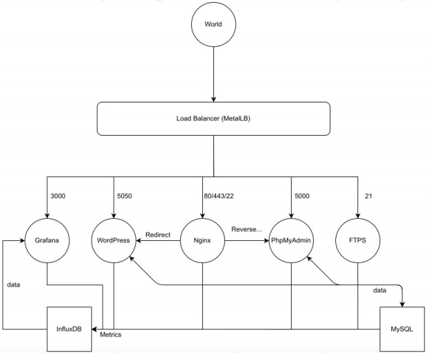

# Ft_services

> This is a system administration and networking project. The aim of the project is to discover
> cluster management and deployment with Kubernetes by creating a multi-serivce cluster: Nginx,
> Wordpress, PhpMyAdmin, Mysql, FTPS, influxDB, grafana.

_note_: used telegraf for data collection and metallb for load balancing.

## Resources

- [Minimalistic Alpine Dockerfile](http://pushorigin.ru/docker/alpine)
- [Build in PHP](https://habr.com/ru/post/155853/)
- [Nginx documentation](https://nginx.org/ru/docs/beginners_guide.html)
- [Mysql host name](https://kinsta.com/knowledgebase/mysql-hostname/)
- [Access to database](https://kinsta.com/knowledgebase/db-access/)
- [Production DataBases : mysql](https://wiki.alpinelinux.org/wiki/Production_DataBases_:_mysql)
- [Alpine documentation](https://wiki.alpinelinux.org/wiki/Main_Page)
- [Alpine PhpMyAdmin](https://wiki.alpinelinux.org/wiki/PhpMyAdmin)
- [Alpine Nginx](https://wiki.alpinelinux.org/wiki/Nginx)
- [Alpine MariaDB](https://wiki.alpinelinux.org/wiki/MariaDB)
- [Alpine Wordpress](https://wiki.alpinelinux.org/wiki/WordPress)
- [Alpine SSH](https://wiki.alpinelinux.org/wiki/Setting_up_a_ssh-server)
- [PhpMyAdmin documentation](https://docs.phpmyadmin.net/en/latest/)
- [Nginx/php](https://wiki.alpinelinux.org/wiki/Nginx_with_PHP)
- [Metallb: load balancer](https://metallb.universe.tf/usage/)
- [Nginx conf for php-fpm](https://github.com/christophelimpalair/nginx_series/blob/master/Episode_4.md)
- [Question: 13 Permission denied](https://qna.habr.com/q/127571)
- [SSH conf manual](https://linux.die.net/man/5/ssh_config)
- [SSHD conf manual](https://linux.die.net/man/5/sshd_config)
- [Habr SSH](https://habr.com/ru/post/122445/)
- [Habr FTP-Server](https://habr.com/ru/post/128117/)
- [Question: understanding-volume-instruction-in-dockerfile](https://stackoverflow.com/questions/41935435/)
- [telegraf](https://docs.influxdata.com/telegraf/v1.12/)
- [influxDB](https://docs.influxdata.com/influxdb/v2.0/get-started/)
- [influxdb guide](https://tproger.ru/translations/influxdb-guide/)
- [influxdb + telegraf](https://www.dmosk.ru/miniinstruktions.php?mini=telegraf-influxdb)
- [Alpine packages](http://dl-cdn.alpinelinux.org/alpine/edge/testing/)
- [Influx docker](https://github.com/influxdata/influxdata-docker/tree/636da53f332fd930ea15b2d4d54614571cbeff2d)
- [Alpine ready packages](http://dl-cdn.alpinelinux.org/alpine/v3.12/main/x86_64/)
- [vsftpd](https://security.appspot.com/vsftpd.html)
- [vsftpd passive mode](http://tokarchuk.ru/2011/02/vsftpd-passive-mode-firewall-iptables-ubunt/)
- [vsftpd manual](https://www.opennet.ru/base/net/vsftpd_overview.txt.html)
- [Grafana](https://grafana.com/docs/grafana/latest/administration/provisioning/)